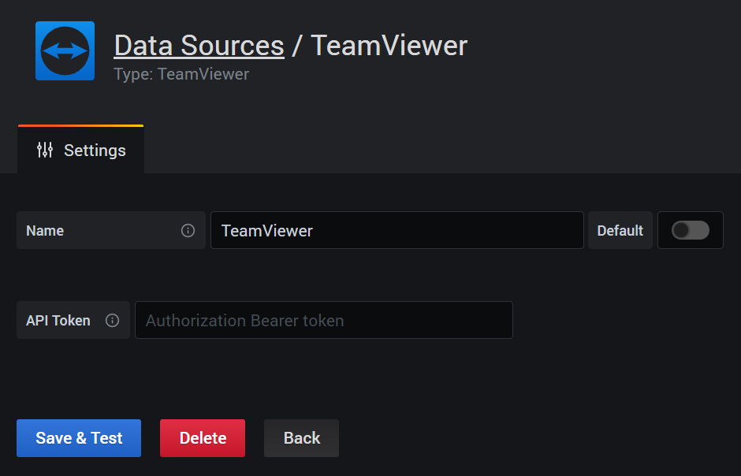
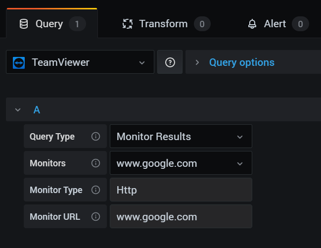

# TeamViewer Datasource for Grafana 


[](https://github.com/teamviewer/grafana-teamviewer-datasource/blob/master/CHANGELOG.md)
[](https://raw.githubusercontent.com/teamviewer/grafana-teamviewer-datasource/main/LICENSE)

Visualize your [Teamviewer Web Monitoring](https://www.teamviewer.com/en/remote-management/web-monitoring/) metrics with the leading open source software for time series analytics.

## Installation

Install by using *grafana-cli*,

```bash
grafana-cli plugins install teamviewer
```

Install manually

Download the plugin at your plugin path (i.e. `/var/lib/grafana/plugins`),
then unzip the plugin there with,

```bash
unzip teamviewer-datasource.zip
```

After all those steps restart the Grafana Server service, and you should see the plugin there.

## Configuration

Configure the Datasource with the API Bearer Token (without the word "Bearer"), and save the Datasource.



Now you can configure a panel on your dashboard as follows,



For more information, please refer to the [Wiki](https://github.com/teamviewer/grafana-teamviewer-datasource/wiki) page.

## Contributing

Refer to [CONTRIBUTING.md](https://github.com/teamviewer/grafana-teamviewer-datasource/blob/main/CONTRIBUTING.md)

## License

Apache License 2.0, see [LICENSE](https://github.com/teamviewer/grafana-teamviewer-datasource/blob/main/LICENSE).
